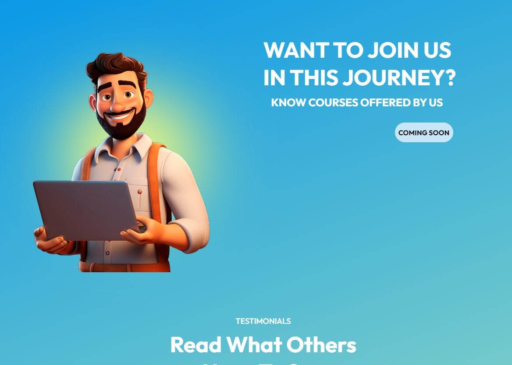
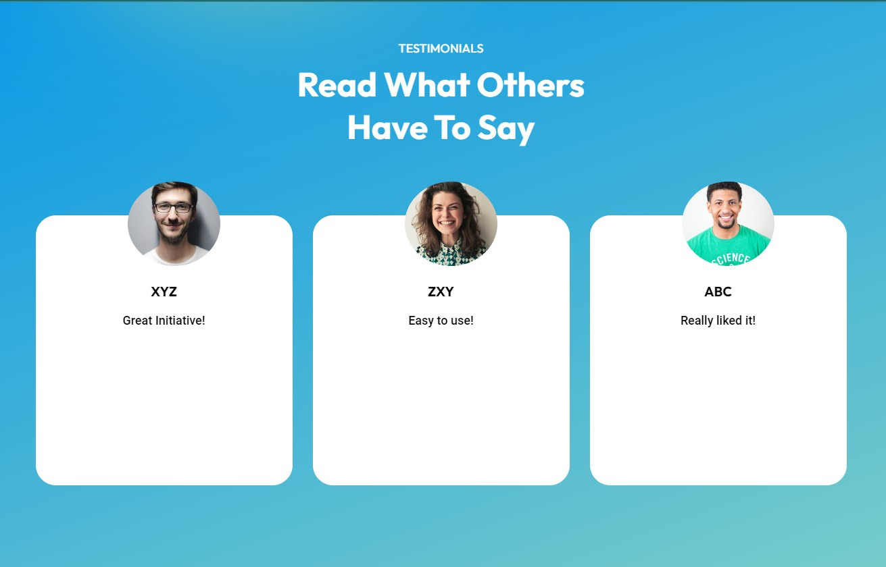
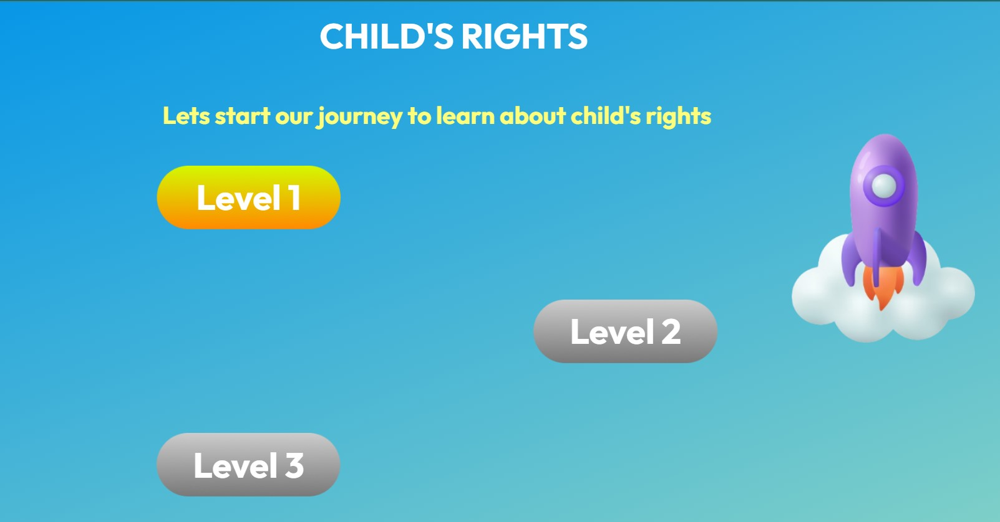

# Project Chanakya

## Home Page

## Levels Preview

## Project Description

Project Chanakya is a dedicated initiative aimed at developing an innovative gamified platform to educate and empower children with knowledge about their rights. In a concerted effort to enhance legal literacy and awareness among the youth in India, this project delivers engaging and interactive modules tailored to make learning about rights enjoyable and accessible.

### Key Objectives

- **Education Through Engagement:** The platform uses gamification to make learning about fundamental rights interactive and enjoyable for children.
- **Empowering Tomorrow's Citizens:** By fostering an understanding of legal rights from a young age, we aim to empower children to become informed and responsible citizens.
- **Enhancing Access to Knowledge:** We seek to bridge the gap in legal literacy by providing an accessible and engaging resource for children across diverse backgrounds and regions.

This project aspires to make a meaningful impact by equipping young minds with essential knowledge about their rights, thereby enabling them to navigate the world with confidence and awareness.
